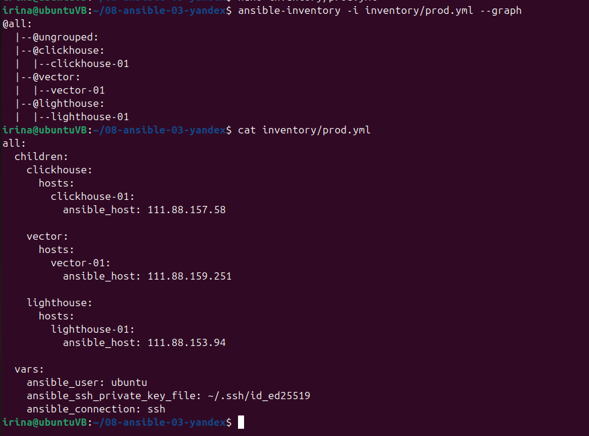
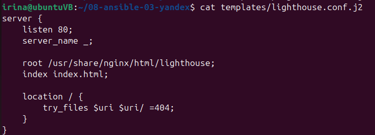
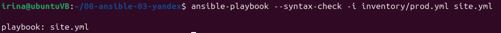
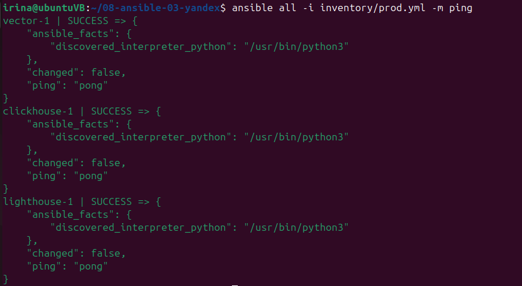
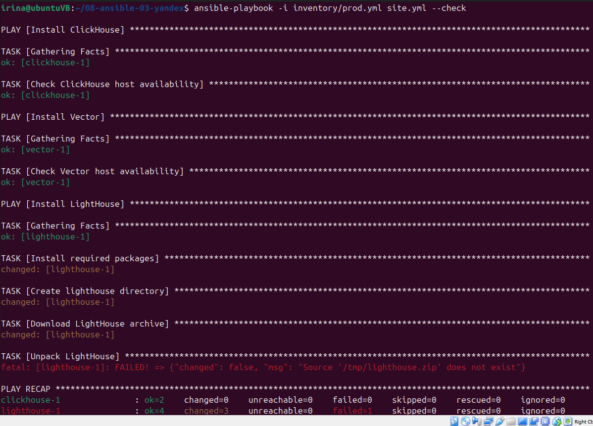
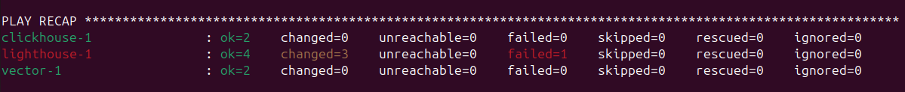
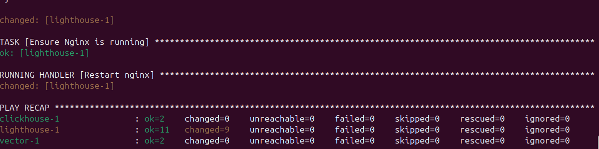
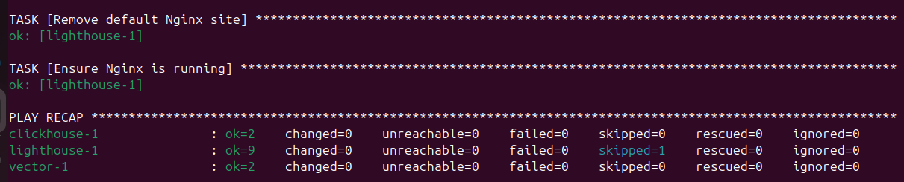
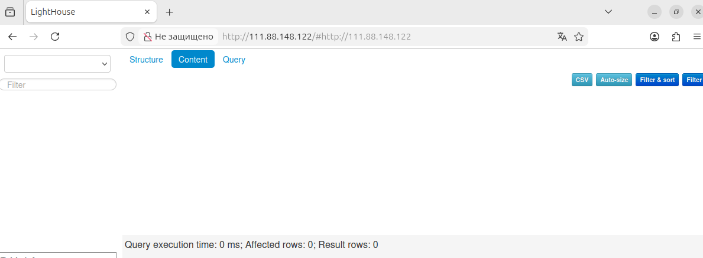

# Домашнее задание к занятию 3 «Использование Ansible»
создала структуру проекта

создала ligthouse и проверила что playbook рабочий

далее создала prod.yml, и проверила ping всех 3х ВМ

lfktt cltkfkf play для ligthouse, шаблон для nginx, проверила ansible-lint и запустила в режиме --check. Чтобы посмотреть какие изменения будут внесены. 

первый запуск с --diff

и проверка идемпотентности: второй запуск с той же командой --diff. Где видно, что изменений=0.

проверка ligthouse:

